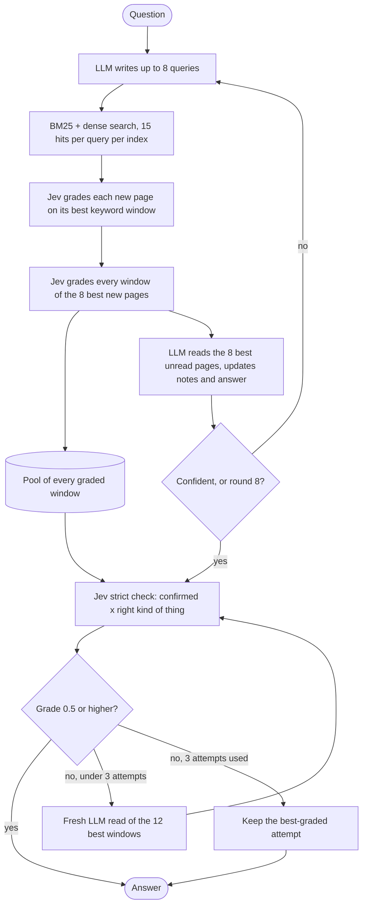

# jev-bcp

BrowseComp-Plus with a **cheap LLM** and **Jev**, TypeSafe's non-generative "System One" model.

Jev does not write text. You give it a state (text or JSON) and typed questions, and it returns
probabilities: `noul` (yes/no), `choice`, `score`. It costs $0.042 per million input tokens, the state is
billed once however many questions you ask about it, and the account limit is 250k tokens per second.
This repo asks how far that gets you on a hard retrieval benchmark when the only generative model is a
cheap one, and keeps every experiment that answered part of that question, including the ones that failed.

Everything here is measured with the benchmark's **official judge** (Qwen3-32B with the authors' grading
prompt, `src/bcp/judge.py`). An early home-made judge inflated accuracy by about 10 points; nothing in this
README uses it.

## Results

[BrowseComp-Plus](https://huggingface.co/datasets/Tevatron/browsecomp-plus): 830 multi-constraint,
multi-hop questions over a fixed corpus of 100,195 web pages. The benchmark has no train split, so
`data.split()` holds out 630 questions; all tuning happened on the other 200 ("dev").

| System | Split | Accuracy | Notes |
|---|---|---|---|
| **4 flash trajectories + Jev, GPT-5 reads only where they disagree** (`route.py`) | held-out 630 | **89.8%** [87.5, 92.1] | GPT-5 reads 27.5% of the questions, once; 0 errors; ~13 cents per question |
| The same | all 830 | 89.8% [87.7, 91.8] | 745 of 830 |
| **4 flash trajectories + Jev, no strong model** (`bestofn.py`) | held-out 630 | **87.0%** [84.4, 89.7] | the answer cluster with the largest summed strict score; ~10 cents per question |
| One flash trajectory, ColBERT as a third index (`modal_app.py --colbert`) | held-out 630 | 81.0 - 82.5% | four runs; 0 errors |
| DeepSeek-V4-flash + BM25 + Jev grading (first version) | all 830 | 55.8% | level with the paper's GPT-5 + BM25 row (55.9%) |
| DeepSeek-V4-flash + Jev pipeline (`agent.py`), BM25 + dense only | held-out 630 | 79.5% [76.5, 82.5] | 0 errors, ~2.5 cents and ~60 s per question |
| The same with **jevlog** on top (`jevlog.py`) | held-out 630 | 78.9% [75.7, 82.1] | parity on accuracy; adds a proof and a calibrated confidence |
| The same pipeline | dev 200 | 80.0% [74.5, 85.0] | |
| **Ministral 8B + Jev**, one small job per call (`split.py`) | dev 200 | 64.5% [58, 71] | the same model as the whole agent: about 39% |

For scale, on the public leaderboard at the time of writing: best entry 95.2% (GPT-5 multi-agent), GPT-5 +
Qwen3-Embed-8B 71.7% (70.1% in the paper), GPT-5 + BM25 55.9%, GPT-5 + Reason-ModernColBERT 79.5% with the standard
scaffold and 87.6% with a `get_document` tool (LightOn), best open model of 32B or less 68.9%. The routed system uses
the same `openai/gpt-5` (reasoning medium) on about a quarter of the questions. Its interval only just clears 87.6%:
"matches or beats the best GPT-5 row" is the claim the data supports.

On the held-out run the four trajectories agreed on 457 of 630 questions and were right on 95.6% of those; GPT-5's
reads of the other 173 fixed 31 answers and broke 13 (+2.9 points [+0.8, +4.9] over the cheap pick).

jevlog's confidence on the held-out run: answers scored 0.7 or higher were right 91% of the time (277
answers); answers scored below 0.5 were right 66% of the time (219 answers).

### What each piece contributed (dev, flash)

| Change | Accuracy |
|---|---|
| BM25 + Jev grades every hit, LLM reads the best 8 | ~56% |
| + dense retrieval (Qwen3-Embedding-8B); Jev ranks the union, no score fusion | ~63% |
| + final stage: Jev strictly checks the answer, a rejection triggers a fresh read | ~70% |
| + Jev grades every window of a long page and picks the one the reader sees | 75% |
| + the final read uses the best windows of everything Jev graded; crash fixes | 80% |
| + Reason-ModernColBERT as a third index (gold docs in the top 100: 72% -> 85%) | 81.4% (four runs) |
| + four trajectories, keep the answer cluster with the largest summed strict score | 85.5% |
| + where the four disagree, one GPT-5 read of their pooled evidence | 89.5% |

## How the pipeline works



Jev's roles, each validated on labelled data before it was wired in:

- **Grader.** "Does the document state information usable in a direct answer to the question?" separates
  the benchmark's evidence documents from its mined hard negatives with AUC 0.94 (BM25: 0.50, document
  length: 0.64). Its probabilities are well calibrated (expected calibration error 0.045 on 1,302 labelled
  documents). Packing ~26 documents into one request, each inside its own question, gives the same grades
  as one request per document (`arms.py`).
- **Passage picker.** The median page the agent reads is 15,000 characters; Jev grades each 4,000-character
  window and the reader gets the best one.
- **Answer checker.** Two nouls, "every constraint confirmed" x "the right kind of thing", over the question,
  the answer and the best passages. It ranks right above wrong answers with AUC 0.90. As a probability it is
  far too harsh (answers it scores under 0.1 are still right about half the time), so it is used as a
  ranking and a redo trigger, never as a stop rule for search.

### Four trajectories and a routed strong reader (`bestofn.py`, `route.py`)

Reruns of the same pipeline search differently and end on different evidence, so their errors are only partly shared:
on dev any one of four runs is right on 91.5% of questions while a single run is right on 81%. Two label-free steps
turn that into accuracy:

1. **Select.** Jev groups the four answers ("do these name the same thing?"). Each run already carries its own strict
   check score; the cluster with the largest sum wins. 80.0% -> 85.5% on dev (fixed 12, broke 1); majority voting
   gets 85.0%; re-checking every answer against one shared evidence set is a null (82.0%).
2. **Route.** One cluster: keep it (right ~95% of the time). More than one: a strong model reads, once and blind,
   the best 24 windows of every page any run read, graded by Jev. With GPT-5: 85.5% -> 89.5% on dev (fixed 9,
   broke 1). The control shows the gain is the reader and not the pooled evidence: flash doing the identical read
   scores 82.5% (fixed 5, broke 11). Showing GPT-5 the four answers does not help (89.0%).

GPT-5 as the whole agent costs 17.5 cents per question for one trajectory and was level with flash on a 30-question
sample (26 vs 23-27 of 30); routed, it costs 2.2 cents per question on average.

### The small-model shape (`split.py`)

An 8B model asked to be the whole agent (queries, notes and reading in one JSON reply) read a third of the
gold documents and scored about 39%. Given **one small job per call** it scored 64.5%:

1. *writer*: 20 diverse queries per round, schema-constrained, sees the best snippets so far;
2. Jev grades every hit and picks windows;
3. *reader*: answers from the 12 best windows;
4. Jev strict check: pass stops, fail starts the next round. A second read in reversed order records whether
   two reads agree, which is the confidence signal.

Small single jobs help search enormously. They do **not** help reading: splitting the reading into
per-page fact extraction lowered the perfect-evidence ceiling by about 8 points for both models.

## jevlog: a language the LLM writes and Jev executes

```
find K : person "a lighthouse keeper"
find D : person "the lighthouse keeper's daughter"
find C : place  "a port city"
find Y : year   "the year the daughter was born"
fact daughter_of(D, K) "{D} is the daughter of {K}, a lighthouse keeper"
fact founded(D, C)     "{D} founded a botanical society in {C}"
fact club(C, Y)        "the football club of {C} was founded in {Y}"
fact born(D, Y)        "{D} was born in {Y}"
answer D
```

(The example question is invented. Benchmark text never appears in this repo.)

- `find` declares something the question describes but does not name; `fact` is one checkable claim;
  `answer M, Y` may name several variables. A variable shared by two facts is a join.
- **Semantics.** A binding gives the variables values. P(fact | binding) is the maximum over passages of
  Jev's probability that the passage states the instantiated claim, so copies of one page count once. A
  binding's score is the **mean** over all facts; minimum and product were measured and do not separate
  right from wrong, because Jev's cells are correlated and a missing passage is not a refutation.
- **Execution.** Jev cannot name things, so the LLM proposes bindings from the best passages, Jev fills the
  binding x fact grid, and every claim of the leading bindings that no passage supports yet is searched *by
  name* and graded against that claim. The best binding's answer comes back with its proof table.
- **The compiler is checked.** Programs are parsed before they run; a parse error goes back to the LLM
  (about 10-15% of programs need one repair round). An unparseable program degrades to a one-fact
  program instead of failing the question.
- **As middleware** (`--evidence agent`): the agent pipeline searches and answers first; its evidence and
  its answer are handed to jevlog. The grid may overrule the agent only where two independent reads of the
  evidence already doubt the agent's answer **and** another candidate leads by 0.25. Every unconditional
  override policy fixed as many answers as it broke.

What jevlog is good for today: a **proof table and a calibrated confidence** per answer, and
claim-conditioned search (below). What it does not do: raise accuracy. On 630 held-out questions it changed
78 answers, fixed 13 and broke 17.

## What did not work

Kept in the repo because a documented null result is worth more than a forgotten one. All on the dev split.

| Idea | Result | Where |
|---|---|---|
| Force more search when Jev doubts the notes | 63.7% -> 58.9%; the extra rounds talked the LLM out of right answers | removed |
| Candidate x constraint grid steering the search | 63.0% -> 63.0% | `grid.py`, `--grid` |
| Grade every window of every page to rank pages | gold docs in Jev's top 8: 75.1% -> 74.5%, at 9x the tokens | `rank.py` |
| Grade pages fact by fact, entities unnamed | top 8: 79.0% -> 67.6%; one unnamed fact matches hundreds of pages | `atoms.py` |
| Reader gets Jev-picked 400-char excerpts from 34 pages | gold coverage 72% -> 88%, accuracy unchanged | `snip.py`, `EXCERPTS` |
| Strict check without the reader's notes; search before each redo | fixed 11 broke 7; fixed 9 broke 8 | `replay.py` |
| Reader writes a proof, Jev checks each step | AUC 0.76, below the plain strict check (0.79) | `proof.py` |
| One recursive solve() instead of two loops | 19/30 vs 23/30, 2.3x the cost | `recurse.py` |
| Two reads disagree -> search wider | +1 point; re-reading broke half of the right answers it touched | `widen.py` |
| Jev facets (page type, era, region) as filters | keep 54% of gold while keeping 23% of all pages | `store.py` |
| [Laya](https://huggingface.co/convaiinnovations/laya) (open ModernBERT model with Jev's API) in Jev's seat | AUC 0.65 at best vs Jev 0.94; 512-token budget | `scripts/laya_*.py` |
| 40 or 64 windows in the final read instead of 12 | 78.5% -> 79.5% on 200 questions (fixed 12, broke 10) | `widerread.py` |
| Claim-conditioned deep Jev sweep | "every gold doc in the reader's input" 59.5% -> 81% of questions; accuracy 79.0% -> 79.0% | `claimsweep.py` |
| Whole documents per claim; small high-precision packet | flat; the small packet matches at 1/4 the reading cost | `claimsweep.py` |
| Variable profiles; rank fusion over claims | gold in top 40 on the hardest questions: 28% -> 9%; 14% | `claimsweep.py`, `scripts/rrf.py` |
| 16 search rounds instead of 8 | 13/40 vs 14/40 (control rerun) | `scripts/rounds.py` |
| Sail-shaped loop: an orchestrator that never reads, single-page readers that name bridge entities | 20/40 vs 23/40 at 4x the cost; the readers dropped 95% of what Jev kept, the same failure as `atoms.py` | `swarm.py` |
| Corpus-wide card store (an LLM card per page): card search + entity hop as two more retrievers | every gold doc in the first round's pool 27% -> 53%; one frozen read 65.5% -> 77.5%; **in the agent 80.0 / 82.5% vs 81.4%** at 1.75x the Jev tokens | `cards.py`, `hop.py`, `store3.py` |
| Jev instead of the LLM for entity extraction (regex proposes names, Jev filters) | gold in the hop pool 93.6% vs 95.6%, pool 25% larger, ~8x the cost of LLM cards | `jevents.py` |
| Four trajectories written with different search styles | the same as four plain reruns; hard core 0 of 60 trajectories | `bestofn.py --gen` |
| Every candidate answer strict-checked against one shared evidence set | 82.0% vs 85.5% for each run's own score | `bestofn.py` |

### What the failures add up to

- With **every gold document handed to the reader in full**, flash answers 92.5% (right answer among 5
  samples: 95.5%), an 8B 85-87%. Any two cheap readers together reach 93-95.5%: their errors overlap.
- Six different reads of each dev question: all six right on 62%, none right on 13%. Majority voting has no
  headroom.
- That hard core is mostly questions whose gold pages can only be ranked once a bridge entity has a *name*.
  A deep unnamed search finds 72% of those pages; Jev's whole-question grade then ranks them out.
- Two independent reads agreeing: the answer is right 92% of the time (flash) or 82% (8B); disagreeing:
  about 32%. It is the best wrong-answer detector here, and same-model rereads do not repair what it finds.
- So in this architecture cheap readers cap out below 95%. The offline, corpus-wide entity index has now been built
  and tested (`store2.py` against hard negatives: gold docs in Jev's top 40 63% -> 93%): it is the fifth change that
  put far more gold pages in front of the agent without moving its accuracy. Retrieval is not this agent's
  bottleneck; reading is. The two things that did move accuracy are selection across independent trajectories and a
  stronger reader on the questions where they disagree, which is also the only thing that touched the hard core
  (1 -> 4 of 15 on dev).

## Layout

```
src/bcp/
  data.py       de-obfuscates the dataset, builds cases, dev/held-out split
  corpus.py     the 100k corpus, BM25 index, windows and excerpts
  dense.py      the authors' Qwen3-Embedding-8B index; queries embedded through OpenRouter
  jev.py        Jev client: grading (single and batched), on-disk response cache, retries
  judge.py      the official grader prompt and parser
  agent.py      the pipeline; `llm()` is the one OpenRouter / self-hosted chat client
  final.py      strict check + redo
  split.py      the small-model pipeline
  bestofn.py    N trajectories, label-free selectors
  route.py      the published system: cluster the trajectories' answers, keep or send to a strong reader
  jevlog.py     the language: parser, compiler prompt, runtime, runner
  jevdiag.py    why a jevlog run lost its questions: never proposed vs proposed-not-picked
  metrics.py    AUC, nDCG, ECE, bootstrap and paired bootstrap
  run.py        the first experiment: Jev vs BM25 vs length on evidence vs hard negatives
  ...           one file per experiment; each docstring states the question, the method and the result
modal_app.py    the agent on Modal (a 200-question run in ~10 minutes); --colbert, --hop add retrievers
modal_colbert.py  Reason-ModernColBERT search on a Modal GPU, over LightOn's prebuilt index
modal_llm.py    a small model served with vLLM on Modal, OpenAI-compatible
scripts/        one-off experiment scripts kept for reproducibility
tests/          network-free unit tests
```

Experiments by question: `arms.py` (request shape), `oracle.py` (reader ceiling), `recall.py`
(query-writer recall), `cells.py` (grid offline), `replay.py` (final-stage variants), `agree.py` (two
readers), `rank.py` / `atoms.py` / `snip.py` (ranking and reader input), `store.py` / `store2.py` (offline
knowledge store), `widerread.py` / `claimsweep.py` (evidence delivery), `lateint.py` (late-interaction recall),
`cards.py` / `hop.py` / `store3.py` / `jevents.py` (corpus-wide card store and entity hop), `swarm.py` (orchestrator +
single-page readers), `bestofn.py` / `route.py` (trajectory selection and the routed reader).

## Setup

```
uv sync
export TYPESAFE_API_KEY=...       # Jev
export OPENROUTER_API_KEY=...     # LLM, embeddings for queries, the judge
make test                         # network-free
```

The first run downloads the dataset, the corpus and the authors' dense index from Hugging Face (into the
Hugging Face cache) and builds a BM25 index under `data/` (about 900 MB). Jev responses are cached under
`data/jev_cache/`.

```
# the pipeline, locally (resumable: rerun the same command after a crash)
uv run python -m bcp.agent --model deepseek/deepseek-v4-flash-0731 --all --workers 8 --out out/full

# on Modal: dev split in ~10 minutes
modal run modal_app.py::prepare
modal run modal_app.py --model deepseek/deepseek-v4-flash-0731                  # dev 200
modal run modal_app.py --model deepseek/deepseek-v4-flash-0731 --split held     # held-out 630
modal run modal_app.py --model mistralai/ministral-8b-2512 --roles              # small-model pipeline

# the published system: four trajectories, ONE run at a time (two at once hit Jev's rate limit), then route
modal run modal_colbert.py::prepare && COLBERT_WARM=6 modal deploy modal_colbert.py   # redeploy with 0 afterwards
for i in 1 2 3 4; do modal run modal_app.py --model deepseek/deepseek-v4-flash-0731 --split held --colbert --out out/held_cb_$i; done
uv run python -m bcp.route --final --split held --runs out/held_cb_1 out/held_cb_2 out/held_cb_3 out/held_cb_4 \
    --strong openai/gpt-5 --reasoning medium --out out/publish/held

# jevlog on top of the pipeline; the agent stage is cached per question, so language changes are paired
uv run python -m bcp.jevlog --model deepseek/deepseek-v4-flash-0731 --evidence agent --n 60
uv run python -m bcp.jevlog --model deepseek/deepseek-v4-flash-0731 --evidence agent --split held --n 630 \
    --seeds out/jevlog_seeds_held --out out/final
uv run python -m bcp.jevdiag out/final
```

`--model` is always required and is an OpenRouter model id. `agent.use_endpoint(url)` points every LLM call
at a self-hosted OpenAI-compatible server instead.

### Cost and speed (flash, per question)

| | Pipeline | + jevlog |
|---|---|---|
| Wall time | ~60 s | ~92 s |
| LLM calls / input tokens | ~8 / ~55k | ~15 / ~141k |
| Jev tokens | ~510k (2.1 cents) | ~640k (2.7 cents) |

The routed system: four trajectories 10.2 cents; a GPT-5 read is ~21k tokens in and ~5k out (7.8 cents) on 27.5% of the
questions, 2.2 cents on average; Jev grading the pooled evidence for those questions 0.9 cents. 13 cents in all.

Throughput is set by Jev's 250k tokens per second, not by compute. On Modal, one question reaching the
per-input timeout kills its container and the other questions in it, so `agent.DEADLINE` ends the search
well before that.

## Method notes

- **Dev / held-out.** `data.split(n_dev=200, seed=0)`. Tune on dev, report on held-out, run held-out once per
  configuration. Questions that error count as wrong.
- **Small samples lie.** A 30-question set swings by +/-8 points and a rerun of the same configuration by
  about +/-2.5 points on 200. Every comparison that mattered here was paired on identical evidence
  (`out/jevlog_seeds`) or rerun with a control arm.
- **Validate, then wire in.** Each Jev use was first measured against labels (evidence vs hard negatives,
  right vs wrong answers) before it touched the pipeline.
- **Operational.** Two Modal runs at once exceed Jev's rate limit (errors count as wrong); a `map` over an empty
  to-do list never returns; the ColBERT searcher needs warm containers during a run (`COLBERT_WARM`).
- **Deviation from the paper's setup:** the judge is the official model and prompt, called through
  OpenRouter instead of a local vLLM.

## Data handling

BrowseComp-Plus ships obfuscated (base64 + XOR with a canary-derived key) so that its text does not leak into
training corpora. `data/` and `out/` hold de-obfuscated text and are gitignored. **Never commit them, and never
paste benchmark questions, answers or documents into issues, docs or prompts that leave your machine.**
